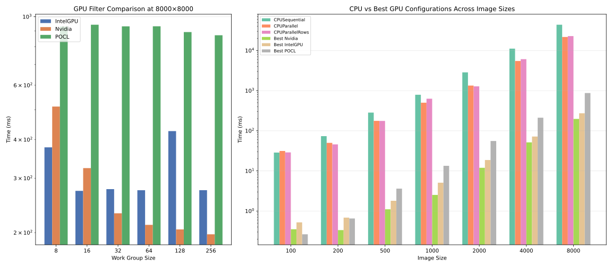

# Brahma.FSharp GPGPU Examples: Image Processing & Matrix Multiplication

GitHub Actions |
:---: |
[](https://github.com/gsvgit/ImageProcessing/actions?query=branch%3Amaster) |
[](https://github.com/gsvgit/ImageProcessing/actions?query=branch%3Amaster) |

---

This repository contains practical, educational examples of **General-Purpose computing on Graphics Processing Units (GPGPU)** using the **F#** programming language. It serves as a hands-on guide to leveraging the [**Brahma.FSharp**](https://github.com/YaccConstructor/Brahma.FSharp) library for writing parallel code that executes on OpenCL-compatible devices like GPUs.

The primary goal is to demonstrate how to accelerate common computational problems by offloading them from the CPU to the GPU, showcasing both the performance potential and the implementation patterns in F#.

Few example how to utilize GPGPU in F# code using [Brahma.FSharp](https://github.com/YaccConstructor/Brahma.FSharp).

## ✨ Features

This project currently includes two classic GPGPU examples:

1.  **Image Convolution**: Applies filters (Gaussian blur, edge detection) to images using a configurable kernel. This operation is inherently parallel — each output pixel can be computed independently from its neighbors — making it an ideal candidate for GPU acceleration. (Located in [`src/ImageProcessing/`](src/ImageProcessing)).

    | Implementation | Function | Parallelism |
    |---|---|---|
    | CPU Sequential | `applyFilter` | Single-threaded pixel loop |
    | CPU Parallel (per-pixel) | `applyFilterCpuParallel` | `Array.Parallel.iter` over flat pixel array |
    | CPU Parallel (per-row) | `applyFilterCpuParallelRows` | `Array.Parallel.iter` over rows, sequential within each row |
    | GPU (any OpenCL device) | `applyFiltersGPU` | OpenCL kernel, configurable local work size |

    **Streaming mode**: A `MailboxProcessor`-based pipeline that loads images from a directory, distributes them across multiple filter workers (each potentially on a different platform), and saves results — all concurrently.

    **CLI**: Argu-based argument parser supports `--input`, `--output`, `--platform` (6 backends), `--work-group-size`, and `--workers` for streaming.

2.  **Matrix Multiplication**: Implements the multiplication of two large matrices on the GPU. This is a fundamental operation in many scientific and engineering domains and perfectly illustrates data-parallel computing. (Located in [`src/MatrixMultiplication/`](src/MatrixMultiplication) ). Inspired by [Cedric Nugteren's OpenCL SGEMM tutorial](https://cnugteren.github.io/tutorial/pages/page1.html).

    Implemented kernels (K0–K4), each building on the previous with progressive optimizations:

    | Kernel | Description |
    |---|---|
    | **K0** | Naive: each thread computes one output element, adding each pairwise product directly to the global memory cell of the result matrix |
    | **K1** | Local accumulator: each thread computes one output element using a mutable local register before writing to global memory once |
    | **K2** | Local memory tiling: tiles of both input matrices are loaded into local memory for reuse, each thread computes one output element |
    | **K3** | Increased work per thread: each thread computes `WPT` output elements from tiles in local memory |
    | **K4** | 2D register blocking: each thread computes a `TTS × TTS` tile of the output for maximal data reuse |

Both examples are designed to be simple to understand while demonstrating core concepts like kernel definition, memory management, and execution on a compute device.

---

## 📁 Repository Structure

The project is organized for clarity and ease of navigation:

*   `src/`: Contains all source code.
    *   `ImageProcessing/`: `Image` type, filter kernels, CPU/GPU convolution, `MailboxProcessor` streaming pipeline, CLI entry point.
    *   `MatrixMultiplication/`: Matrix multiplication kernels (K0–K4) and CLI entry point.
*   `tests/`: Unit tests for the examples, ensuring correctness.
    *   `ImageProcessing.Tests/`: Xunit tests for all CPU and GPU filter variants.
    *   `MatrixMultiplication.Tests/`: Xunit tests for matrix multiplication kernels.
*   `benchmarks/`: Performance benchmarks.
    *   `MatrixMultiplication.Benchmarks/`: Benchmarks for matrix multiplication kernels K0–K4.
    *   `ImageProcessing.Benchmarks/`: Benchmarks for image convolution on all CPU and GPU backends.
*   `.github/workflows/`: GitHub Actions CI/CD pipelines for automated building and testing.


## 🚀 Getting Started

Follow these instructions to get the project up and running on your local machine for development and experimentation.

### Prerequisites

Before you begin, ensure you have the following installed:

*   **[.NET 9.0 SDK](https://dotnet.microsoft.com/en-us/download/dotnet/9.0)** or higher.
*   **Option A (Recommended for GPU acceleration):** An **OpenCL-compatible device** (e.g., a discrete or integrated GPU) with the **respective vendor driver** installed. (e.g., NVIDIA drivers for NVIDIA GPUs, ROCm or AMD drivers for AMD GPUs, or Intel OpenCL runtime for Intel GPUs/CPUs).
*   **Option B (CPU fallback - great for testing/learning):** If you don't have a GPU or want to experiment on CPU first, install **[POCL](http://portablecl.org/) (Portable Computing Language)**. POCL is an open-source OpenCL implementation that runs on CPUs, allowing you to run all examples without dedicated graphics hardware.
    *   **On Ubuntu/Debian:** `sudo apt install pocl-opencl-icd`
    *   Check the [official POCL installation guide](https://portablecl.org/docs/html/install.html) for installation options.

### Installation & Build

1.  **Clone the repository:**
    ```bash
    git clone https://github.com/gsvgit/ImageProcessing.git
    cd ImageProcessing
    ```

2.  **Build the project:**
    This command compiles the code and restores any necessary NuGet packages.
    ```bash
    dotnet build -c Release
    ```

---

## 📊 Matrix Multiplication Benchmarks

The `benchmarks/MatrixMultiplication.Benchmarks/` project uses **BenchmarkDotNet** to measure GPU kernel execution times for all 5 matrix multiplication kernels (K0–K4) across matrix sizes 256–2048 and various work-group configurations.

As far as benchmarks iterate over all possible configurations, they can be used as a tuner to choose optimal kernel configuration for particular device.

### Benchmark classes

| Class | Extra params | Kernel |
|---|---|---|
| `K0Benchmark` | — | `multiplyKernel0` |
| `K1Benchmark` | — | `multiplyKernel1` |
| `K2Benchmark` | — | `multiplyKernel2` |
| `K3Benchmark` | `WPT`: 1, 2, 4, 8 | `multiplyKernel3` with `workPerThread` |
| `K4Benchmark` | `TTS`: 1, 2, 4, 8 | `multiplyKernel4` with `threadTileSize` |

Common parameters across all classes:
- **N** — matrix size: 256, 512, 1024, 2048
- **LWS** — local work size: 8, 16, 32, 64, 128, 256 (device-dependent, some values may be invalid)

### Design

- **Measurement**: posts kernel command (async via `MailboxProcessor`) then synchronizes with `CreateToHostMsg` on a 1-element buffer — measures wall-clock GPU execution time
- **Data transfer excluded**: buffers are allocated and filled with random data in `[GlobalSetup]`, outside the timed portion
- **Cleanup**: `CreateFreeMsg` on all `ClArray` buffers in `[GlobalCleanup]`
- **Invalid configs**: fail in `[GlobalSetup]` with descriptive message → BenchmarkDotNet marks as `NA` and continues

### How to run

```bash
# Full run all kernels (default device):
dotnet run -c Release --project benchmarks/MatrixMultiplication.Benchmarks

# Quick smoke test (ShortRun = 3 warmup + 3 actual iterations):
dotnet run -c Release --project benchmarks/MatrixMultiplication.Benchmarks -- --job short --filter *K0Benchmark*

# Selective kernels:
dotnet run -c Release --project benchmarks/MatrixMultiplication.Benchmarks -- --filter *K3Benchmark*

# Specific OpenCL device:
dotnet run -c Release --project benchmarks/MatrixMultiplication.Benchmarks -- --device nvidia
dotnet run -c Release --project benchmarks/MatrixMultiplication.Benchmarks -- --device intel
dotnet run -c Release --project benchmarks/MatrixMultiplication.Benchmarks -- --device cpu
```

BenchmarkDotNet passes remaining CLI arguments (like `--filter`, `--job`, `--stopOnFirstError`) through to its own parser. Results are exported as CSV, Markdown, and HTML to `BenchmarkDotNet.Artifacts/results/`.

---

## 📊 Image Processing Benchmarks

The `benchmarks/ImageProcessing.Benchmarks/` project uses **BenchmarkDotNet** to measure filter processing times across all available backends — CPU sequential, CPU parallel (per-pixel and per-row), and GPU (POCL, Nvidia, Intel GPU) — for square images from 100×100 up to 8000×8000 pixels.

### Benchmark classes

| Class | Device param | Extra params |
|---|---|---|
| `CpuFilterBench` | `CPUSequential`, `CPUParallel`, `CPUParallelRows` | — |
| `GpuFilterBench` | `POCL`, `Nvidia`, `IntelGPU` | `LWS`: 8, 16, 32, 64, 128, 256 |

Common parameter across all classes:
- **Size** — image side in pixels: 100, 200, 500, 1000, 2000, 4000, 8000

### Design

- **Image generation**: each benchmark generates a random square image (deterministic seed `Random 42`) in `[GlobalSetup]` — excluded from measurement
- **Filter**: all benchmarks use `gaussianBlurKernel` (5×5 normalized) — a module-level constant, not recreated per invocation
- **Measurement**: the `[Benchmark]` method applies exactly one filter pass and discards the result; only the processing time is captured
- **GPU setup**: `ClContext` and GPU applier are created once in `[GlobalSetup]`; the device name is printed at startup
- **No redundant combinations**: `LWS` is only parameterized for GPU benchmarks — CPU benchmarks have zero useless LWS configurations

### How to run

```bash
# Full run (interactive menu selects CPU or GPU benchmarks):
dotnet run -c Release --project benchmarks/ImageProcessing.Benchmarks

# Quick smoke test (CPU only, ShortRun):
dotnet run -c Release --project benchmarks/ImageProcessing.Benchmarks -- --job short --filter *CpuFilterBench*

# GPU benchmarks with specific LWS range:
dotnet run -c Release --project benchmarks/ImageProcessing.Benchmarks -- --filter *GpuFilterBench*

# Run only one device variant:
dotnet run -c Release --project benchmarks/ImageProcessing.Benchmarks -- --filter "*CPUParallel*"
```

BenchmarkDotNet passes remaining CLI arguments (like `--filter`, `--job`, `--stopOnFirstError`) through to its own parser. Results are exported as CSV, Markdown, and HTML to `BenchmarkDotNet.Artifacts/results/`.

### Analysis script

The Python script [`benchmarks/analyze_benchmarks.py`](benchmarks/analyze_benchmarks.py) reads the CSV results and generates two comparison plots:

- **GPU work-group size comparison** (left): compares Intel UHD Graphics 620, NVIDIA GeForce MX150, and POCL (CPU OpenCL) across all work-group sizes (8–256) at the largest image (8000×8000)
- **CPU vs best GPU configurations** (right): compares all three CPU variants (sequential, pixel-parallel, rows-parallel) against the best-performing LWS per GPU device across all image sizes



**Requirements:** `pandas`, `matplotlib`, `numpy`

```bash
pip install pandas matplotlib numpy
python benchmarks/analyze_benchmarks.py
```