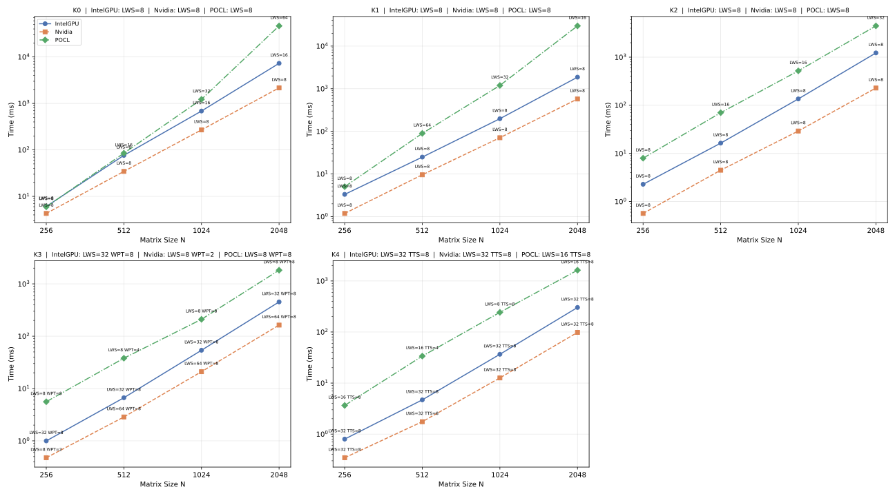
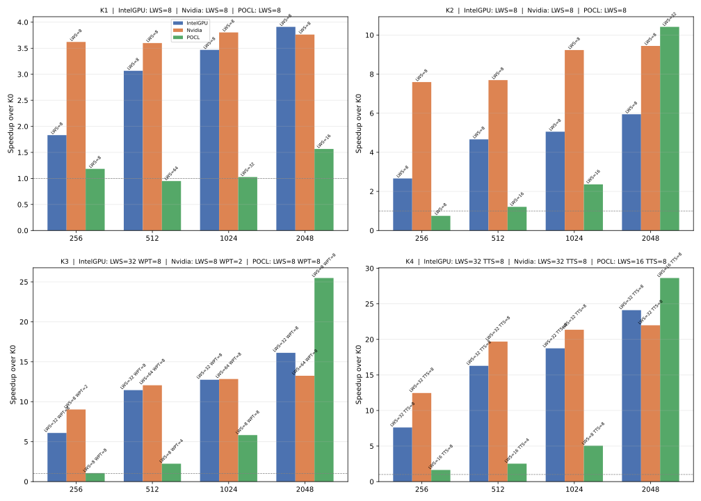
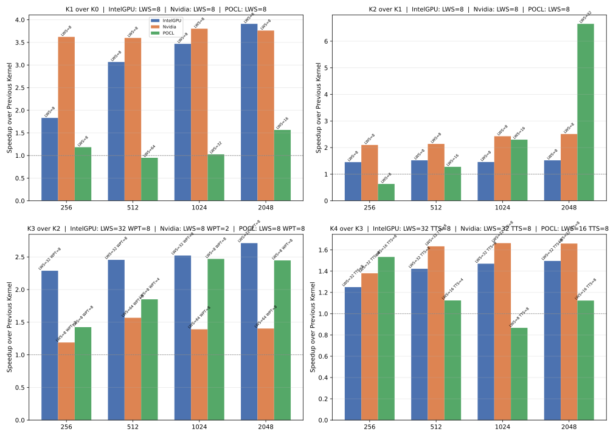
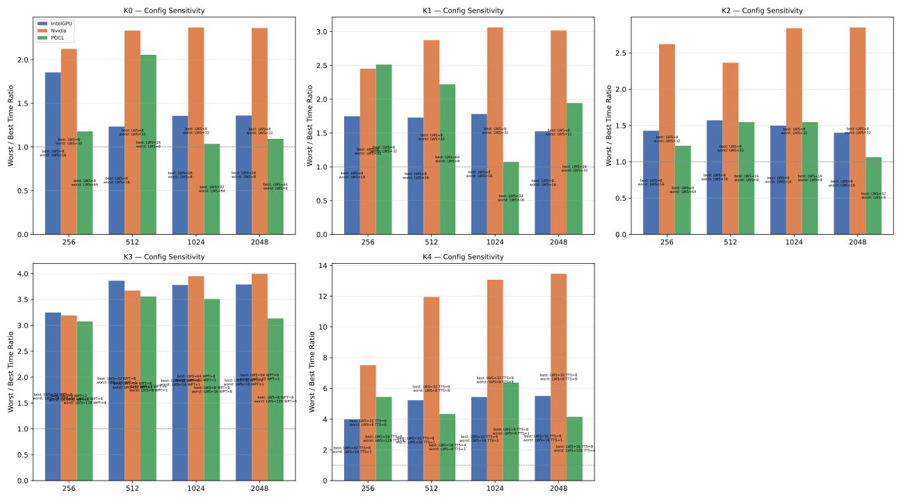

## Matrix Multiplication

Progressive GPU kernel optimizations (K0–K4), inspired by [Cedric Nugteren's OpenCL SGEMM tutorial](https://cnugteren.github.io/tutorial/pages/page1.html).
All kernels compute **C = A * B** and are parametrized by element type and element-wise operations.

### Kernels

| Kernel | Description |
|---|---|
| **K0** | Naive: each thread computes one output element, adding each pairwise product directly to the global memory cell of the result matrix |
| **K1** | Local accumulator: each thread computes one output element using a mutable local register before writing to global memory once |
| **K2** | Local memory tiling: tiles of both input matrices are loaded into local memory for reuse, each thread computes one output element |
| **K3** | Increased work per thread: each thread computes `WPT` output elements from tiles in local memory |
| **K4** | 2D register blocking: each thread computes a `TTS × TTS` tile of the output for maximal data reuse |

---

## Benchmarks

The `benchmarks/MatrixMultiplication.Benchmarks/` project uses **BenchmarkDotNet** to measure GPU kernel execution times for all 5 matrix multiplication kernels (K0–K4) across matrix sizes 256–2048, various work-group configurations, and all OpenCL platforms (POCL, Nvidia, Intel GPU).

As far as benchmarks iterate over all possible configurations, they can be used as a tuner to choose optimal kernel configuration for particular device.

### Benchmark classes

| Class | Extra params | Kernel |
|---|---|---|
| `K0Benchmark` | — | `multiplyKernel0` |
| `K1Benchmark` | — | `multiplyKernel1` |
| `K2Benchmark` | — | `multiplyKernel2` |
| `K3Benchmark` | `WPT`: 1, 2, 4, 8 | `multiplyKernel3` with `workPerThread` |
| `K4Benchmark` | `TTS`: 1, 2, 4, 8 | `multiplyKernel4` with `threadTileSize` |

Common parameters across all classes:
- **N** — matrix size: 256, 512, 1024, 2048
- **LWS** — local work size: 8, 16, 32, 64, 128, 256 (device-dependent, some values may be invalid)
- **Device** — OpenCL platform: `POCL`, `Nvidia`, `IntelGPU` (iterated by BDN via `[Params]`)

### Design

- **Measurement**: posts kernel command (async via `MailboxProcessor`) then synchronizes with `CreateToHostMsg` on a 1-element buffer — measures wall-clock GPU execution time
- **Data transfer excluded**: buffers are allocated and filled with random data in `[GlobalSetup]`, outside the timed portion
- **Cleanup**: `CreateFreeMsg` on all `ClArray` buffers in `[GlobalCleanup]`
- **Invalid configs**: fail in `[GlobalSetup]` with descriptive message → BenchmarkDotNet marks as `NA` and continues

### How to run

```bash
# Full run all kernels on all devices:
dotnet run -c Release --project benchmarks/MatrixMultiplication.Benchmarks

# Quick smoke test (ShortRun, single kernel):
dotnet run -c Release --project benchmarks/MatrixMultiplication.Benchmarks -- --job short --filter '*K0Benchmark*'

# Selective kernel:
dotnet run -c Release --project benchmarks/MatrixMultiplication.Benchmarks -- --filter '*K3Benchmark*'
```

BenchmarkDotNet passes remaining CLI arguments (like `--filter`, `--job`, `--stopOnFirstError`) through to its own parser. Results are exported as CSV, Markdown, and HTML to `BenchmarkDotNet.Artifacts/results/`.

### Analysis script

The Python script [`benchmarks/analyze_benchmarks.py`](../benchmarks/analyze_benchmarks.py) with `--mode mxm` reads all 5 kernel CSVs and generates 6 comparison plots:

1. **Best config per kernel** (2×3 grid): for each kernel K0–K4, bars show minimum execution time per (N, Device) triple, annotated with the configuration that achieved that minimum (LWS for K0–K2; LWS + WPT for K3; LWS + TTS for K4)
2. **Per-device all configurations** (1×3 grid): for each device, all valid configs as individual bars grouped by N then by kernel
3. **HPC-style scaling overview** (2×3 grid): log-log lines, one subplot per kernel, 3 device lines annotated with best config
4. **Speedup over K0** (2×2 grid): bars showing ratio relative to K0 baseline for K1–K4
5. **Speedup stepwise** (2×2 grid): successive speedup K1/K0 → K4/K3
6. **Config sensitivity** (2×3 grid): worst/best time ratio per (N, Device), composite best/worst label inside each bar

```bash
python benchmarks/analyze_benchmarks.py --mode mxm
```

Examples of plots:






